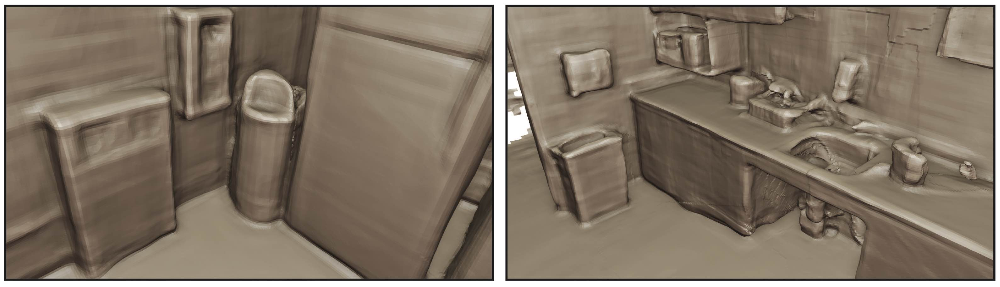

# FineRecon

This software project accompanies the research paper, [FineRecon: Depth-aware Feed-forward Network for Detailed 3D Reconstruction](https://arxiv.org/abs/2304.01480).

FineRecon is a deep learning model for 3D reconstruction from posed RGB images.



## Setup

### Dependencies

```
pip install \
  matplotlib \
  pillow \
  numpy \
  scikit-image \
  scipy \
  timm \
  torch==1.13 \
  torchvision \
  "tqdm>=4.65" \
  trimesh \
  pytorch_lightning==1.8 \
  pyyaml \
  opencv-python-headless \
  python-box \
  tensorboard
```

### Config

```
cp example-config.yml config.yml
```
The paths in `config.yml` will need to be edited to point to the data directories.

### Data

FineRecon requires an RGB-D scan dataset such as ScanNet, which can be downloaded and extracted using the [scripts](https://github.com/ScanNet/ScanNet/tree/master/SensReader/python) provided by the ScanNet authors.

The dataset structure expected by FineRecon is

```
/path/to/dataset/
    test.txt
    train.txt
    val.txt
    first_scan/
        color/
            0.jpg
            1.jpg
            2.jpg
            ...
        depth/
            0.png
            1.png
            2.png
            ...
        intrinsic_color.txt
        intrinsic_depth.txt
        pose.npy
    second_scan/
    ...
    last_scan/
```

The files `test.txt`, `train.txt`, and `val.txt` should each contain a newline-separated list of scan directory names (e.g. `first_scan`) describing the test, train, and validation splits respectively. Each `pose.npy` contains the camera poses (world-to-camera transformation matrices) as an array of size `(N, 4, 4)` in [npy format](https://numpy.org/devdocs/reference/generated/numpy.lib.format.html), where any invalid poses are marked with the value `Inf`. The files `intrinsic_color.txt` and `intrinsic_depth.txt` should contain the `(4, 4)` color and depth intrinsic matrices, respectively. In `config.yml`, the value of `dataset_dir` should be set to `/path/to/dataset`.

To generate the ground truth TSDF run `generate_gt_tsdf.py --dataset-dir /path/to/dataset --output-dir /path/to/gt_tsdf`, and in `config.yml` set the value of `tsdf_dir` to `/path/to/gt_tsdf`.
To run training or inference with depth guidance, make sure `depth_guidance.enabled` is set to `True` in the config and set the value of `depth_guidance.pred_depth_dir` to `/path/to/pred_depth`, which should have the following structure:

```
/path/to/pred_depth/
    first_scan/
        depth/
            0.png
            1.png
            2.png
            ...
        intrinsic_depth.txt
    second_scan/
    ...
    last_scan/
```

It can be helpful to limit inference to only using a set of pre-defined keyframes, because it's faster (particulary with point back-projection enabled) and because depth estimates may not be available for all frames. To do this, set `test_keyframes_file` in the config to the location of a JSON file with the following structure:

```
{
  "first_scan": [i0, i1, i2, ...],
  ...
}
```

where `i0`, `i1`, etc. are the integer indices of the keyframes.

## Training

```
python main.py
```

## Inference

We provide pre-trained weights here: [checkpoint.zip](https://docs-assets.developer.apple.com/ml-research/models/finerecon/checkpoint.zip). These are weights for our main model using resolution-agnostic TSDF supervision, depth guidance, and point-backprojection. We also provide the pre-trained weights corresponding to the ablation study (Table 4): [checkpoints_ablation.zip](https://docs-assets.developer.apple.com/ml-research/models/finerecon/checkpoints_ablation.zip).

```
python main.py --task predict --ckpt path/to/checkpoint.ckpt
```

For convenience, we also provide the inference results (meshes) of our main model on the [ScanNet](http://www.scan-net.org) test set:
- [High-resolution [1 cm]](https://docs-assets.developer.apple.com/ml-research/models/finerecon/meshes-1cm.zip) (2.4 GB) → This is the resolution used in figures and metrics, unless otherwise stated.
- [Low-resolution [4 cm]](https://docs-assets.developer.apple.com/ml-research/models/finerecon/meshes-4cm.zip) (148 MB)

## Evaluation

Evaluation code and data for 3D metrics can be found in [TransformerFusion](https://github.com/AljazBozic/TransformerFusion), and evaluation code for 2D metrics can be found in [Atlas](https://github.com/magicleap/Atlas).

## Citation

```
@article{stier2023finerecon,
  title={{FineRecon}: Depth-aware Feed-forward Network for Detailed 3D Reconstruction},
  author={Stier, Noah and Ranjan, Anurag and Colburn, Alex and Yan, Yajie and Yang, Liang and Ma, Fangchang and Angles, Baptiste},
  journal={arXiv preprint},
  year={2023}
}
```
